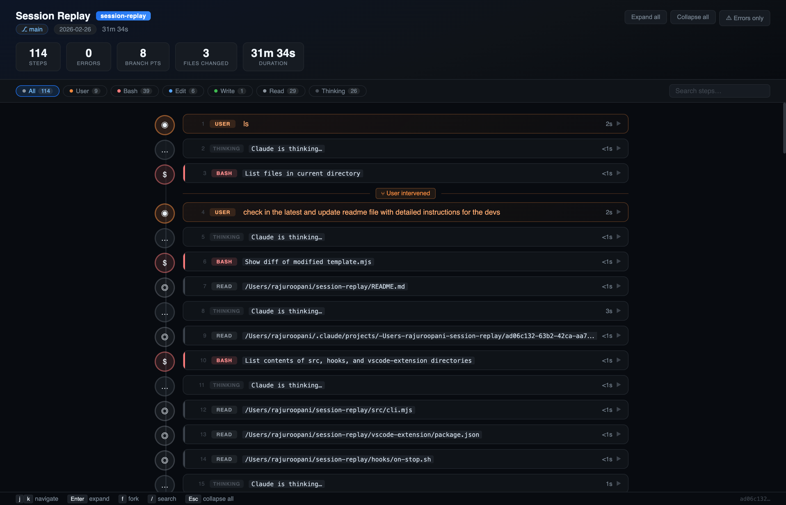
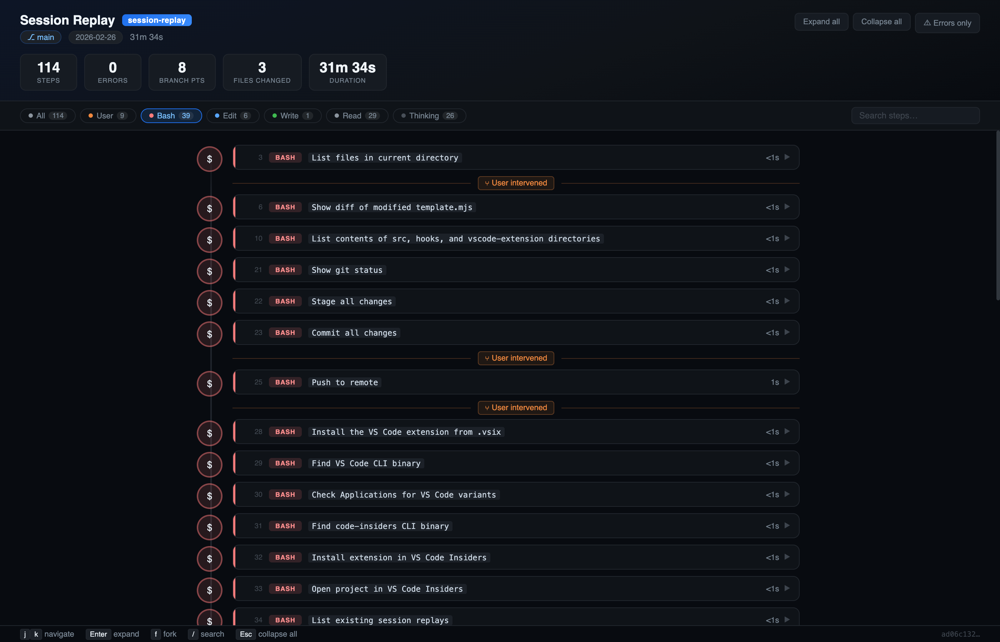
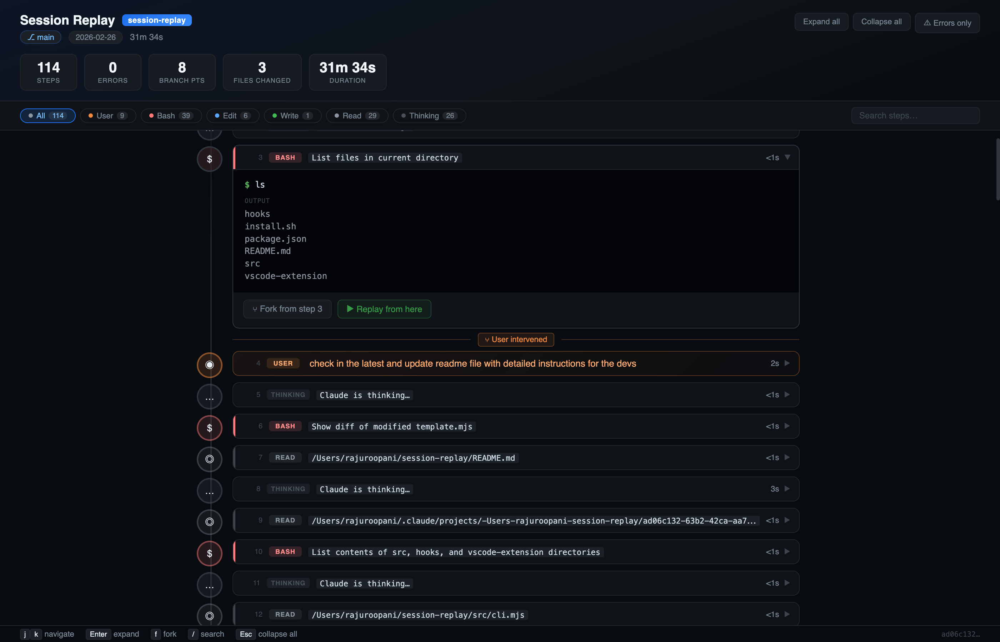
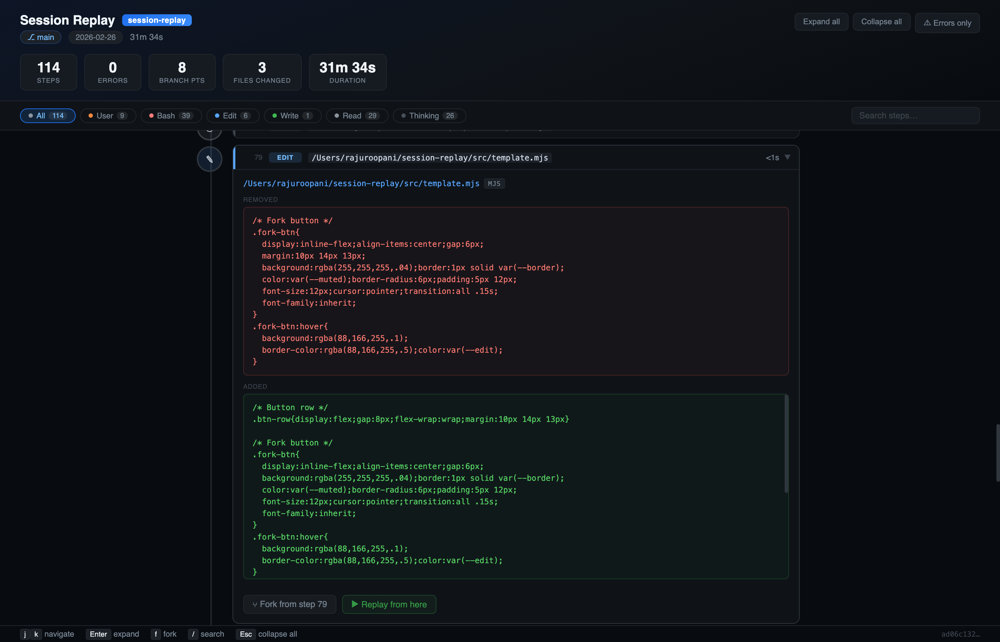

# session-replay

> A flight data recorder for Claude Code sessions.

When an AI agent breaks something, you have no forensics. You just start over.

`session-replay` turns every Claude Code session into an interactive visual timeline — every file edited, every command run, every decision made. Find the exact step where things went wrong, then **fork from there** instead of starting over.

---



---

## Install

```bash
# In any repo
npx session-replay@latest install
# or
git clone https://github.com/RajuRoopani/session-replay
./session-replay/install.sh
```

After install, every Claude Code session auto-generates a replay. No manual steps.

---

## Usage

```bash
# View latest session (opens browser)
npx session-replay

# List all sessions
npx session-replay list

# View specific session
npx session-replay show <session-id>

# Terminal mode (no browser)
npx session-replay show --terminal

# Export as standalone HTML (share with team)
npx session-replay export <id> > replay.html

# Generate a fork prompt from step N
npx session-replay fork <id> <step>
```

---

## What you get

### Full session timeline

Every step Claude took — user messages, thinking blocks, bash commands, file edits, reads — laid out chronologically with color-coded tool badges, durations, and branch point markers.


**Filter by tool type** — click any chip in the filter bar to focus on just Bash, Edit, Read, or error steps. Live search across all step descriptions.



---

### Expand any step for full detail

**Bash steps** show the exact command, stdout, and stderr in a styled terminal block.



**Edit steps** show a before/after diff with language badge and red/green diff blocks — see exactly what changed and why.



---

### Fork or replay from any step

Every expanded step has two action buttons:

- **⑂ Fork from step N** — downloads a `.md` context file ready to paste into a new Claude Code session
- **▶ Replay from here** — opens a new VS Code terminal, `cd`s to the project, and runs `claude` with the full context pre-loaded *(VS Code extension only)*

---

## VS Code Extension

The included VS Code extension renders replays directly inside your editor.

**Features:**
- Status bar button — always visible, one click to open latest replay
- `Cmd+Shift+R` / `Ctrl+Shift+R` keyboard shortcut
- Auto-notification when a new session finishes (with **Open** button)
- Session picker — `Session Replay: Pick Session…` to browse all replays
- Auto-refresh — panel live-reloads as the HTML updates
- **▶ Replay from here** — opens a new integrated terminal and starts `claude` with the fork context

**Install from `.vsix`:**
```bash
code --install-extension vscode-extension/session-replay-vscode-0.1.0.vsix
```

---

## What gets recorded

Everything in a Claude Code session is already stored as a JSONL transcript at
`~/.claude/projects/{project}/{session-id}.jsonl`. `session-replay` reads and
visualizes it — no extra recording needed.

| Event | What's shown |
|---|---|
| User messages | Full text, branch point markers |
| Thinking blocks | Collapsible (Claude's reasoning) |
| File edits (Edit/Write) | Filename, language badge, before/after diff |
| Bash commands | Styled terminal: prompt, stdout, stderr |
| Read/Glob/Grep | Query and results |
| WebFetch/Task | URL or subagent description |
| Failed steps | Red highlight, error badge, details |

---

## How it works

```
Claude Code session ends
  → Stop hook fires (hooks/on-stop.sh)
  → Reads ~/.claude/projects/{project}/{session-id}.jsonl
  → Two-pass parse → TimelineEvent[]
  → Failure detection + branch point tagging
  → Renders self-contained HTML
  → Saves to ~/.session-replays/ and opens in browser
```

---

## Keyboard shortcuts

| Key | Action |
|---|---|
| `j` / `↓` | Next step |
| `k` / `↑` | Previous step |
| `Enter` | Expand / collapse step |
| `f` | Fork from current step |
| `/` | Focus search |
| `Esc` | Collapse all / clear search |

---

## Org-wide auto-capture

Deploy via MDM to `/Library/Application Support/ClaudeCode/managed-settings.json`:

```json
{
  "hooks": {
    "Stop": [{
      "hooks": [{
        "type": "command",
        "command": "/usr/local/share/session-replay/on-stop.sh",
        "timeout": 30,
        "async": true
      }]
    }]
  }
}
```

Every engineer's sessions are captured automatically. Replays go to `~/.session-replays/` on each machine.

---

## Developer Guide

### Requirements

- Node.js ≥ 18 (no build step, pure ESM)
- `jq` (used by `hooks/on-stop.sh`)
- Zero runtime dependencies

### Project structure

```
session-replay/
├── src/
│   ├── cli.mjs          # Entry point — routes show/list/export/fork commands
│   ├── parse.mjs        # JSONL transcript → TimelineEvent[]
│   ├── analyze.mjs      # Failure detection + branch point tagging
│   ├── template.mjs     # Self-contained HTML/CSS/JS viewer (single function)
│   ├── render-html.mjs  # Calls template.mjs, writes ~/.session-replays/*.html
│   ├── render-term.mjs  # ANSI terminal renderer (--terminal flag)
│   └── store.mjs        # Session discovery in ~/.claude/projects/
├── hooks/
│   └── on-stop.sh       # Claude Code Stop hook — fires after every session
├── vscode-extension/
│   ├── extension.js     # VS Code extension (CommonJS, no build required)
│   ├── package.json     # Extension manifest
│   └── *.vsix           # Pre-built installable package
├── screenshots/         # README screenshots
├── .claude/
│   └── settings.json    # Wires hooks/on-stop.sh as a Stop hook locally
└── install.sh           # One-command installer
```

### Data model

**`TimelineEvent`** — one entry per step in the timeline:

```js
{
  step:          number,        // 1-based sequential index
  type:          'user' | 'thinking' | 'tool_call',
  uuid:          string | null,
  timestamp:     string | null, // ISO 8601
  durationMs:    number | null,
  tool: {
    name:        string,        // 'Bash', 'Edit', 'Read', 'Task', …
    input:       object,
    description: string | null,
  } | null,
  result: {
    stdout:      string,
    stderr:      string,
    interrupted: boolean,
    isError:     boolean,
  } | null,
  text:          string | null, // user message text
  thinking:      string | null,
  failed:        boolean,
  isBranchPoint: boolean,
  toolUseId:     string | null,
}
```

### Module responsibilities

| Module | Role |
|---|---|
| `parse.mjs` | Two-pass JSONL → `TimelineEvent[]`. Pass 1 builds `tool_use_id → result` map. Pass 2 emits events chronologically. |
| `analyze.mjs` | Tags `failed` (stderr / exit codes / interrupted) and `isBranchPoint` (user intervened). |
| `template.mjs` | `buildHtml(replayData)` — returns fully self-contained HTML string. All CSS + JS inline, no external requests. |
| `render-html.mjs` | Orchestrates parse → analyze → template, writes to `~/.session-replays/`. |
| `store.mjs` | Discovers sessions under `~/.claude/projects/`. |
| `extension.js` | VS Code webview panel, dir watcher, file watcher, fork/replay terminal handlers. |

### Adding a new tool type

1. Add an icon in `ICONS` in `template.mjs`
2. Add CSS dot class `dot-<key>` and accent class `acc-<key>`
3. Add tool badge class `tb-<key>`
4. Add `safeKey` recognition
5. Add a body renderer case in `renderBody(ev, el)`
6. Add a filter chip in `filterDefs` if useful

### Iterating on the viewer

```bash
# Generate a fresh HTML from any session
session-replay export <session-id> > /tmp/test.html && open /tmp/test.html

# Edits to template.mjs take effect immediately on next export — no build needed
```

---

## Structure

```
session-replay/
├── src/           # Node.js modules (pure ESM, no deps)
├── hooks/         # Claude Code Stop hook
├── vscode-extension/
└── install.sh
```

**Zero dependencies.** Pure Node.js ≥ 18. No build step. Works via `npx`.

---

## License

MIT
